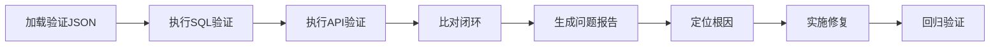

# 验证 JSON 执行与问题分析工作流

本工作流指导 AI 执行验证 JSON 中定义的所有任务，生成详细的问题分析报告，并完成功能修复。

## 工作流概述



## 第一阶段：执行验证任务

### 步骤 1：加载目标模块的验证 JSON

// turbo
```bash
cat docs/validation_json/{模块名}.json
```

### 步骤 2：执行"核心属性验证"

对于每个验证项，执行 SQL 并填入结果：

// turbo
```bash
sqlite3 metadata.db "SELECT COUNT(*) FROM {表名} WHERE {过滤条件}"
```

### 步骤 3：执行"血缘质量检测"

**关键字段空值检测**（检测潜在数据质量问题）：
```sql
-- 示例：检测断链字段
SELECT COUNT(*) FROM fields WHERE table_id IS NULL AND is_calculated = 0;
```

**未匹配血缘检测**（检测孤儿记录）：
```sql
-- 示例：检测无数据源的物理表
SELECT COUNT(*) FROM tables t WHERE t.is_embedded = 0 
  AND NOT EXISTS (SELECT 1 FROM table_to_datasource td WHERE td.table_id = t.id);
```

### 步骤 4：执行"关联元素"的双向验证

对于每个关联：
```sql
-- 正向验证
SELECT COUNT(DISTINCT a.id) || ':' || COUNT(DISTINCT b.id) FROM ...;
-- 反向验证  
SELECT COUNT(DISTINCT b.id) || ':' || COUNT(DISTINCT a.id) FROM ...;
```

验证规则：
- 正向和反向的 COUNT 应当一致
- 如不一致，记录差异并分析原因

### 步骤 5：执行"前端元素对齐"验证

// turbo
```bash
# 启动后端服务（如未启动）
curl -s http://localhost:8201/api/stats | jq
```

对比每个 API 返回值与 SQL 查询结果。

### 步骤 6：执行"逻辑闭环验证"

比对前端数据源与血缘数据源，确认数值完全匹配。

---

## 第二阶段：生成问题分析报告

### 报告结构模板

```markdown
# {模块名} 验证分析报告

**执行时间**: YYYY-MM-DD HH:mm
**验证状态**: ✅ 通过 / ⚠️ 有差异 / ❌ 失败

## 一、执行摘要

| 验证类别     | 通过项 | 异常项 | 通过率 |
| :----------- | :----: | :----: | :----: |
| 核心属性验证 |   X    |   Y    |   Z%   |
| 血缘质量检测 |   X    |   Y    |   Z%   |
| 关联元素验证 |   X    |   Y    |   Z%   |
| 前端元素对齐 |   X    |   Y    |   Z%   |
| 逻辑闭环验证 |   X    |   Y    |   Z%   |

## 二、问题详情

### 2.1 [问题类型]: [问题标题]

**位置**: 验证JSON路径 (如 `关联元素[目标模块='物理表']`)

**预期 vs 实际**:
| 指标        | 预期值 | 实际值 |  差异  |
| :---------- | :----: | :----: | :----: |
| 正向SQL结果 |  X:Y   |  A:B   | ΔX, ΔY |

**影响范围**:
- 涉及 N 条记录
- 影响 N 个下游视图/报表

**根因分析**:
1. 可能原因 A: ...
2. 可能原因 B: ...

**验证SQL** (用于定位具体问题记录):
\`\`\`sql
SELECT * FROM ... WHERE ...
\`\`\`

**问题记录样本**:
| id   | name | 异常字段 | 异常值 |
| :--- | :--- | :------- | :----- |

## 三、修复建议

### 3.1 [修复ID]: [修复标题]

**关联问题**: 问题 2.1

**修复方案**:
\`\`\`python
# 代码修改位置: backend/xxx.py
# 修改内容: ...
\`\`\`

**预期效果**: ...

**回归验证SQL**:
\`\`\`sql
-- 修复后应返回 0
SELECT COUNT(*) FROM ... WHERE ...
\`\`\`

## 四、修复执行记录

| 修复ID |   状态   | 回归验证结果 |
| :----- | :------: | :----------- |
| 3.1    | ✅ 已完成 | 差异已消除   |
```

### 报告生成要点

1. **量化所有差异** - 不使用模糊描述，必须有具体数值
2. **提供具体SQL** - 每个问题必须附带定位SQL和问题样本
3. **根因分析** - 分析到代码级别，指出具体函数/逻辑
4. **可回归验证** - 每个修复必须有验证SQL

---

## 第三阶段：实施修复

### 修复流程

1. **定位代码位置**
   - 根据根因分析定位到具体的 `.py` 或 `.tsx` 文件

2. **实施修复**
   - 遵循项目代码规范
   - 添加必要的注释说明修复意图

3. **回归验证**
   - 重启服务
   - 执行回归验证SQL
   - 确认差异已消除

4. **更新报告**
   - 在报告"修复执行记录"中更新状态

---

## 输出文件

将分析报告保存到：
```
docs/validation_reports/{模块名}_validation_report_{日期}.md
```

---

## 快捷命令

// turbo-all
```bash
# 检查数据库状态
sqlite3 metadata.db ".tables"

# 检查 API 服务状态
curl -s http://localhost:8201/api/stats | head -20

# 执行批量验证 SQL
sqlite3 metadata.db < docs/测试验证/系统设计验证.sql
```

## 参考文档

- [验证 JSON 规范](file:///docs/system_summary/metadata_validation_json_spec.md)
- [前端元素清单](file:///docs/system_summary/frontend_element_spec.md)
- [血缘交叉表](file:///docs/重构方案/重构验证方案.md)
- [API 文档](file:///docs/system_summary/api_details.md)
