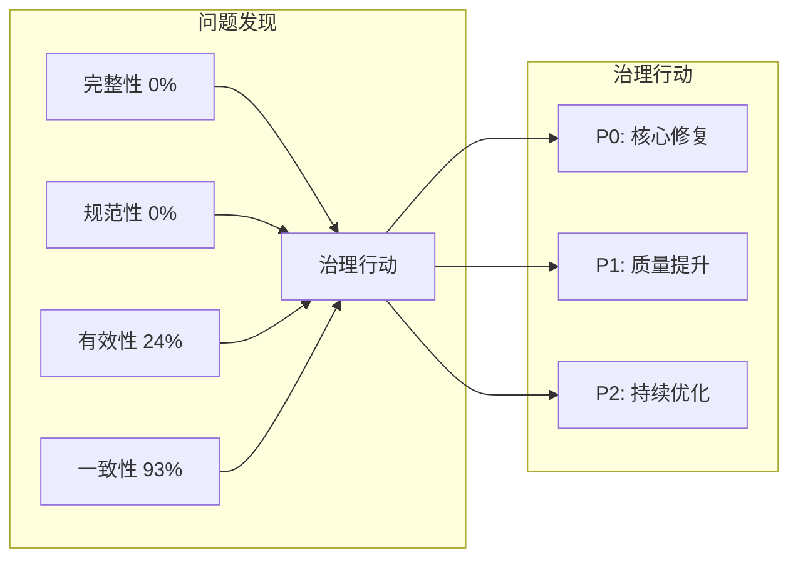

# 07 治理行动计划

> 基于分析结果，制定优先级明确的改进路线图。

---

## 治理问题全景



---

## 问题优先级矩阵

| 问题 | 当前状态 | 影响范围 | 修复难度 | 优先级 |
|-----|---------|---------|---------|-------|
| 字段描述缺失 | 99.96% 无描述 | 全局 | 中 | **P0** |
| 孤立表 | 388个(86%) | 血缘断裂 | 高 | **P0** |
| 未认证数据源 | 100% 未认证 | 信任问题 | 低 | **P1** |
| 孤立字段 | 6341个(76%) | 资源浪费 | 高 | **P1** |
| 孤立数据源 | 27个(51%) | 资源浪费 | 中 | **P1** |
| 重复公式 | 123个 | 一致性 | 低 | **P2** |
| 不支持SQL | 6个数据源 | 兼容性 | 中 | **P2** |

---

## 三阶段行动计划

### Phase 1: 核心修复（第1-2周）

**目标**: 解决最紧迫的治理问题

| 行动项 | 具体步骤 | 责任人 | 预期成果 |
|-------|---------|-------|---------|
| **补充核心字段描述** | 1. 识别使用率 Top 100 字段<br>2. 批量补充描述 | 数据管理员 | 核心字段覆盖率 >80% |
| **清理孤立表** | 1. 导出孤立表清单<br>2. 业务方确认<br>3. 删除或建立关联 | 数据架构师 | 孤立率 <30% |
| **建立认证流程** | 1. 定义认证标准<br>2. 认证核心数据源 | 数据负责人 | Top 10 数据源认证 |

**SQL: 识别高优先级字段**:

```sql
-- 使用率 Top 100 字段（优先补描述）
SELECT f.id, f.name, f.usage_count, ds.name as datasource
FROM fields f
LEFT JOIN datasources ds ON f.datasource_id = ds.id
ORDER BY f.usage_count DESC
LIMIT 100;
```

---

### Phase 2: 质量提升（第3-4周）

**目标**: 系统性提升元数据质量

| 行动项 | 具体步骤 | 责任人 | 预期成果 |
|-------|---------|-------|---------|
| **统一重复公式** | 1. 导出重复公式清单<br>2. 选择标准版本<br>3. 统一命名 | 数据分析师 | 重复率 <5% |
| **清理孤立字段** | 1. 按数据源分组<br>2. 业务确认必要性<br>3. 隐藏/删除 | 数据管理员 | 孤立率 <50% |
| **扩展术语表** | 1. 梳理业务术语<br>2. 补充定义<br>3. 关联字段 | 业务专家 | 术语覆盖 >100 |

**SQL: 导出重复公式**:

```sql
-- 重复公式及对应指标
SELECT formula, GROUP_CONCAT(name, ', ') as metrics, COUNT(*) as cnt
FROM calculated_fields
WHERE formula IS NOT NULL
GROUP BY formula
HAVING cnt > 1
ORDER BY cnt DESC;
```

---

### Phase 3: 持续优化（第5周+）

**目标**: 建立长效治理机制

| 行动项 | 具体步骤 | 责任人 | 预期成果 |
|-------|---------|-------|---------|
| **健康度监控** | 1. 定期运行质量检查<br>2. 生成治理报告<br>3. 追踪改进趋势 | 数据运营 | 健康度 >60 |
| **生命周期管理** | 1. 定义资产阶段<br>2. 自动标记休眠资产<br>3. 定期清理 | 数据架构师 | 僵尸资产 <10% |
| **元数据同步** | 1. 定期同步 Tableau<br>2. 保持血缘更新<br>3. 监控同步状态 | 运维 | 同步成功率 >99% |

---

## 关键指标跟踪（KPI）

| 指标 | 当前值 | Phase 1 目标 | Phase 2 目标 | 最终目标 |
|-----|-------|-------------|-------------|---------|
| 字段描述覆盖率 | 0.04% | 10% | 40% | 80% |
| 数据源认证率 | 0% | 20% | 50% | 80% |
| 表孤立率 | 86% | 50% | 30% | 10% |
| 字段孤立率 | 76% | 60% | 40% | 20% |
| 重复公式数 | 123 | 80 | 30 | <10 |
| 健康度得分 | ~22 | 40 | 60 | 80 |

---

## 治理工具支持

| 当前功能 | 状态 | 建议增强 |
|---------|-----|---------|
| 资产列表 | ✅ | 增加批量编辑 |
| 血缘追踪 | ✅ | 增加可视化图谱 |
| 健康度评分 | ✅ | 细化评分维度 |
| 重复检测 | ✅ | 增加合并建议 |
| 批量导出 | ❌ | 支持 Excel 导出 |
| 批量更新 | ❌ | 支持批量补描述 |
| 定期报告 | ❌ | 自动发送周报 |

---

## 资源需求

| 角色 | 人数 | 工作量 | 周期 |
|-----|-----|-------|------|
| 数据管理员 | 1 | 50% | 4周 |
| 数据架构师 | 1 | 30% | 4周 |
| 业务分析师 | 2 | 20% | 2周 |
| 开发人员 | 1 | 30% | 4周 |

---

## 风险与应对

| 风险 | 影响 | 应对措施 |
|-----|-----|---------|
| 业务方不配合 | 描述补充受阻 | 先完成核心资产，示范价值 |
| 孤立资产误删 | 影响业务 | 严格确认流程，先隐藏后删除 |
| 工作量超预期 | 延期 | 按优先级分批，先做 P0 |

---

## 成功标准

**Phase 1 验收标准**:

- [ ] Top 100 字段有描述
- [ ] 孤立表减少至 <200 个
- [ ] 至少 10 个数据源认证

**Phase 2 验收标准**:

- [ ] 重复公式减少 50%
- [ ] 孤立字段减少至 <3000 个
- [ ] 术语表条目 >100

**最终验收标准**:

- [ ] 健康度得分 >60
- [ ] 核心资产 100% 有描述
- [ ] 建立常态化治理机制
