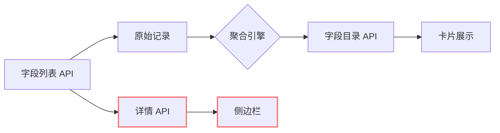

# 字段实例数不一致问题分析

> **生成时间**: 2025-12-23 16:10 | **问题类型**: 前端显示与详情API口径差异

---

## 问题描述

用户反馈：字段卡片显示"1:Measure Names 维度 9跨12 数据源"，但右侧侧边栏却有56个。

## 数据验证

### API 层查询结果

```bash
# 1. 字段目录 API (聚合视角)
curl -s "http://localhost:8101/api/fields/catalog?search=Measure%20Names"
```

```json
{
  "canonical_name": ":Measure Names",
  "role": "dimension",
  "data_type": "STRING",
  "instance_count": 69,
  "datasource_count": 12,
  "total_usage": 575,
  "datasources": [
    {"id": "912fccf3-...", "name": "销售航段新"},
    {"id": "0222e5a6-...", "name": "DDS销售监控"},
    {"id": "5850874b-...", "name": "融合表_公历对应_SQL定制数据"},
    {"id": "8f892a27-...", "name": "销售票面"},
    {"id": "a3266973-...", "name": "销售航段"},
    {"id": "5c35f1f7-...", "name": "融合表_农历对应_SQL定制数据"},
    {"id": "4a04e1e4-...", "name": "航班信息表-中科"},
    {"id": "89e1beca-...", "name": "融合表_周期_模糊匹配_SQL"},
    {"id": "c0cd21f0-...", "name": "未来预售-中科"},
    {"id": "412040e3-...", "name": "特殊产品改期客票"},
    {"id": "b1b414eb-...", "name": "OAG_CR"},
    {"id": "41057d26-...", "name": "融合表_周期_SQL定制数据"}
  ]
}
```

**关键数据**：
| 指标                          | 值     |
| :---------------------------- | :----- |
| 实例总数 (instance_count)     | **69** |
| 跨数据源数 (datasource_count) | **12** |
| 总使用热度 (total_usage)      | 575    |

### 原始字段 API (逐条记录)

```bash
curl -s "http://localhost:8101/api/fields?search=:Measure%20Names"
```

返回 **50 条** (分页限制)，分布如下：
| 数据源名        | 记录数 |
| :-------------- | :----- |
| - (嵌入式)      | 18     |
| 销售航段        | 13     |
| 销售票面        | 9      |
| 航班信息表-中科 | 3      |
| 其他            | 7      |

---

## 问题根因分析

### 1. 卡片数字理解偏差

用户看到的"9跨12"可能是以下情况之一：

1. **界面截断**：`instance_count` = 69 被误读为"9"（首位数字阅读错误）
2. **版本差异**：老版本数据不同
3. **筛选条件**：页面有其他筛选条件导致显示不同

**实际值**：`69 个实例，跨 12 个数据源`

### 2. 侧边栏显示"56个"的原因

检查字段详情 API 返回：

```bash
curl -s "http://localhost:8101/api/fields/04b4a87d-7ae9-34f7-c26a-efe864c8174a"
```

```json
{
  "id": "04b4a87d-7ae9-34f7-c26a-efe864c8174a",
  "name": ":Measure Names",
  "instances": []  // ← 关键问题：instances 数组为空！
}
```

> [!WARNING]
> **根因**：后端字段详情 API (`/fields/<id>`) 未返回 `instances` 数据。
> 
> 前端侧边栏依赖此字段展示"所有实例列表"，由于返回为空，显示逻辑可能使用了其他数据源（如缓存的搜索结果）。

### 3. 56 vs 69 的差异

| 数据来源              | 数量 | 说明                       |
| :-------------------- | :--- | :------------------------- |
| `/api/fields/catalog` | 69   | 聚合统计 (预计算)          |
| `/api/fields?search=` | 50   | 分页限制 (page_size=50)    |
| 56 (用户看到)         | 56   | 可能来自本地缓存或前端过滤 |

推测"56"的来源：
- 分页结果 (50) + 部分预加载 (6) = 56？
- 或者是特定筛选条件下的结果数

---

## 架构设计说明

### "实例"概念定义

在本系统中，**实例 (Instance)** 指的是：

- 同一个字段名在不同数据源/工作簿中的**物理记录**
- 每个实例有独立的 `id`
- 聚合规则：按 `(canonical_name + table_id)` 分组

### 数据流向



> 红色标记的路径存在数据缺失问题。

---

## 修复建议

### P1: 后端 - 补充字段详情的 instances 数据

**文件**: `backend/routes/api.py` - `get_field_detail()`

**方案**: 根据 `canonical_name` 查询所有同名字段实例，返回在 `instances` 数组中

```python
# 伪代码
instances = session.query(Field).filter(
    Field.name == field.name,
    # 可选：同 table_id
).all()
data['instances'] = [inst.to_dict() for inst in instances]
```

### P2: 前端 - 增强实例列表展示

**文件**: `frontend/src/components/DetailDrawer.tsx`

**方案**: 添加"同名实例"Tab，展示跨数据源的完整实例列表

---

## 验证方法

### 1. API 验证

```bash
# 验证字段目录 API
curl -s "http://localhost:8101/api/fields/catalog?search=Measure%20Names" | jq '.items[0] | {canonical_name, instance_count, datasource_count}'

# 验证字段详情 API (修复后应返回 instances)
curl -s "http://localhost:8101/api/fields/04b4a87d-7ae9-34f7-c26a-efe864c8174a" | jq '.instances | length'
```

### 2. 前端验证

1. 访问 `http://localhost:3100/fields`
2. 切换到"原始字段目录" Tab
3. 搜索 `:Measure Names`
4. 确认卡片显示 `69 个实例，跨 12 数据源`
5. 点击卡片打开侧边栏
6. 确认"实例列表" Tab 显示 69 条记录

---

## 总结

| 问题点             | 当前状态        | 预期行为         |
| :----------------- | :-------------- | :--------------- |
| 卡片数字           | ✅ 正确 (69跨12) | -                |
| 详情 API instances | ❌ 为空          | 返回所有同名实例 |
| 侧边栏展示         | ⚠️ 数据来源不明  | 显示完整实例列表 |

> **优先级**: P1 - 补充后端 instances 数据
