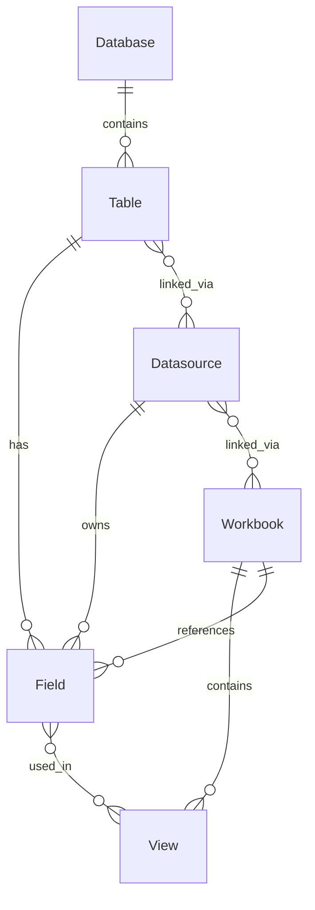

# Tableau 元数据治理平台 - 数据库设计文档

## 架构概述

采用 **SQLite** + **SQLAlchemy ORM** 设计，分为三大模块：

---

## 一、核心实体表

### 1. `databases` - 数据库连接

| 字段 | 类型 | 说明 |
|------|------|------|
| `id` | VARCHAR(255) PK | Tableau LUID |
| `name` | VARCHAR(255) | 数据库名称 |
| `connection_type` | VARCHAR(100) | 连接类型 (snowflake, sqlserver, excel-direct) |
| `host_name` | VARCHAR(500) | 主机地址 |
| `platform` | VARCHAR(50) | 平台 (cloud/on-prem) |
| `created_at` | DATETIME | 创建时间 |
| `updated_at` | DATETIME | 更新时间 |

---

### 2. `tables` - 数据表

| 字段 | 类型 | 说明 |
|------|------|------|
| `id` | VARCHAR(255) PK | Tableau LUID |
| `name` | VARCHAR(255) | 表名 |
| `full_name` | VARCHAR(500) | 完整表名 (含 schema) |
| `schema` | VARCHAR(255) | Schema 名称 |
| `database_id` | VARCHAR(255) FK | 所属数据库 |
| `connection_type` | VARCHAR(100) | 连接类型 |
| `is_embedded` | BOOLEAN | 是否内嵌 |

---

### 3. `fields` - 字段

| 字段 | 类型 | 说明 |
|------|------|------|
| `id` | VARCHAR(255) PK | Tableau LUID |
| `name` | VARCHAR(255) | 字段名 |
| `data_type` | VARCHAR(100) | 数据类型 (float, int, string) |
| `remote_type` | VARCHAR(100) | 原始类型 (NUMBER(18,2)) |
| `description` | TEXT | 字段描述 |
| `table_id` | VARCHAR(255) FK | 所属表 |
| `datasource_id` | VARCHAR(255) FK | 所属数据源 |
| `workbook_id` | VARCHAR(255) FK | 所属工作簿 |
| `is_calculated` | BOOLEAN | 是否计算字段 |
| `formula` | TEXT | 计算公式 |
| `role` | VARCHAR(50) | 角色 (measure/dimension) |

---

### 4. `datasources` - 数据源

| 字段 | 类型 | 说明 |
|------|------|------|
| `id` | VARCHAR(255) PK | Tableau LUID |
| `name` | VARCHAR(255) | 数据源名称 |
| `project_name` | VARCHAR(255) | 项目名称 |
| `owner` | VARCHAR(255) | 所有者 |
| `has_extract` | BOOLEAN | 是否有数据提取 |
| `extract_last_refresh_time` | DATETIME | 最后刷新时间 |
| `is_certified` | BOOLEAN | 是否认证 |
| `certification_note` | TEXT | 认证说明 |

---

### 5. `workbooks` - 工作簿

| 字段 | 类型 | 说明 |
|------|------|------|
| `id` | VARCHAR(255) PK | Tableau LUID |
| `name` | VARCHAR(255) | 工作簿名称 |
| `project_name` | VARCHAR(255) | 项目名称 |
| `owner` | VARCHAR(255) | 所有者 |

---

### 6. `views` - 视图/仪表板

| 字段 | 类型 | 说明 |
|------|------|------|
| `id` | VARCHAR(255) PK | Tableau LUID |
| `name` | VARCHAR(255) | 视图名称 |
| `workbook_id` | VARCHAR(255) FK | 所属工作簿 |

---

### 7. `calculated_fields` - 计算字段详情

| 字段 | 类型 | 说明 |
|------|------|------|
| `field_id` | VARCHAR(255) PK/FK | 关联字段 |
| `name` | VARCHAR(255) | 计算字段名 |
| `formula` | TEXT | 公式 |
| `reference_count` | INT | 引用次数 |
| `complexity_score` | FLOAT | 复杂度评分 |

---

## 二、血缘关系表

### `table_to_datasource` - 表→数据源

| 字段 | 类型 | 说明 |
|------|------|------|
| `table_id` | FK | 上游表 |
| `datasource_id` | FK | 下游数据源 |
| `relationship_type` | VARCHAR(50) | 关系类型 |

### `datasource_to_workbook` - 数据源→工作簿

| 字段 | 类型 | 说明 |
|------|------|------|
| `datasource_id` | FK | 上游数据源 |
| `workbook_id` | FK | 下游工作簿 |

### `field_to_view` - 字段→视图

| 字段 | 类型 | 说明 |
|------|------|------|
| `field_id` | FK | 字段 |
| `view_id` | FK | 视图 |
| `used_in_formula` | BOOLEAN | 是否用于公式 |

---

## 三、指标治理表

### `metrics` - 标准指标

| 字段 | 类型 | 说明 |
|------|------|------|
| `id` | VARCHAR(255) PK | 指标 ID |
| `name` | VARCHAR(255) | 指标名称 |
| `formula` | TEXT | 计算公式 |
| `formula_hash` | VARCHAR(64) | 公式哈希 (去重) |
| `metric_type` | VARCHAR(50) | 类型 |
| `status` | VARCHAR(50) | 状态 (active/review/deprecated) |
| `complexity_score` | INT | 复杂度 |

### `metric_variants` - 指标变体

记录同一指标的不同命名版本。

### `metric_duplicates` - 重复检测

记录疑似重复的指标对，用于合并治理。

---

## 四、系统表

### `sync_logs` - 同步日志

| 字段 | 类型 | 说明 |
|------|------|------|
| `id` | INT PK | 日志 ID |
| `sync_type` | VARCHAR(50) | 类型 (full/incremental) |
| `status` | VARCHAR(50) | 状态 |
| `started_at` | DATETIME | 开始时间 |
| `completed_at` | DATETIME | 完成时间 |
| `records_synced` | INT | 同步记录数 |
| `error_message` | TEXT | 错误信息 |

---

## 五、当前数据统计

| 表名 | 记录数 |
|------|--------|
| databases | 134 |
| tables | 450 |
| fields | 8304 |
| calculated_fields | 4768 |
| datasources | 53 |
| workbooks | 78 |
| views | 1344 |
